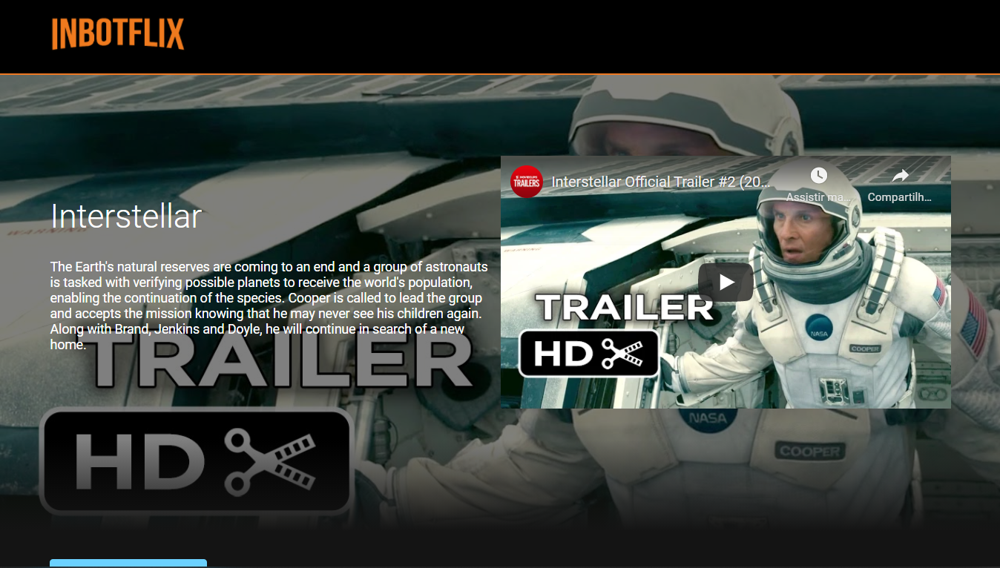
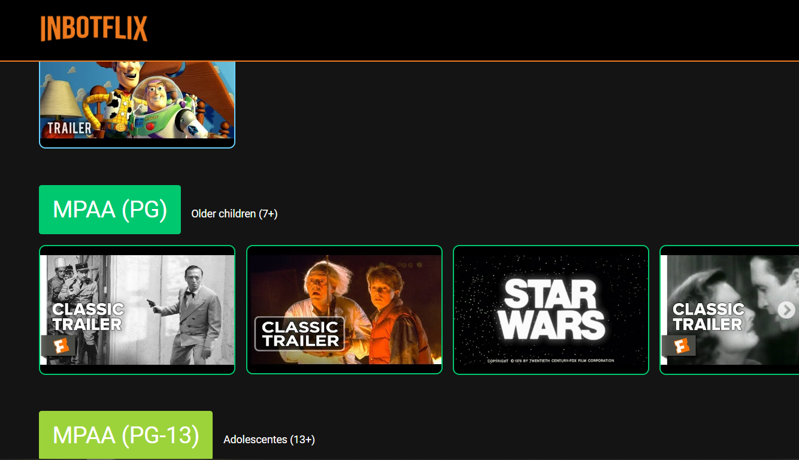
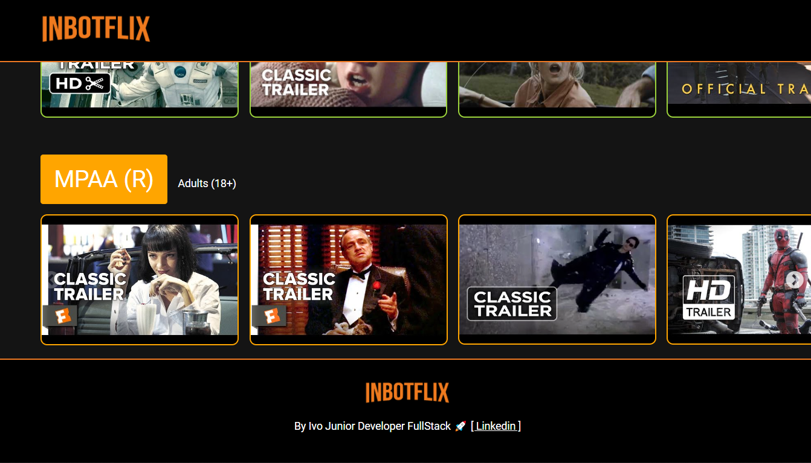

<h1 align="center">
    
</h1>

[We are ONLINE, try Now](https://inbotflix.vercel.app) :tada:<br>


<h4 align="center">
  A platform where you can watch your favorite movies sorted by matirity.
</h4>

<p align="center">
  <a href="#rocket-technologies">Technologies</a>&nbsp;&nbsp;&nbsp;|&nbsp;&nbsp;&nbsp;
  <a href="#information_source-how-to-use">How To Use</a>&nbsp;&nbsp;&nbsp;|&nbsp;&nbsp;&nbsp;
  <a href="#sunny-result">Result</a>
</p>


## :rocket: Technologies

This project was developed with the following technologies:

- [ReactJS](https://reactjs.org/)
- [styled-components](https://www.styled-components.com/)


## :information_source: How To Use

To clone and run this application, you'll need [Git](https://git-scm.com), [Node.js v12.18.4][nodejs] or higher + [Yarn v1.22][yarn] or higher installed on your computer. From your command line:

```bash
# Clone this repository
$ git clone https://github.com/Ivo-Jr/inbotflix-challenge-fullStack.git

# Go into the repository
$ cd inbotflix-challenge-fullStack

# Install dependencies
$ yarn or npm install

# Run the app
$ yarn dev
```

## :file_folder: Folder structure

```bash

.

├── public
│   └── inbot.ico
│   └── index.html
│
├── src >> source code
│   ├── assets
│   │   └── img
│   │       └── inbotflix.png
│   │    └── layout
│   │        └── print01.png
│   │        └── print02.png
│   │        └── print03.png
│   │
│   ├── components
│   │   └── BannerMain
│   │   │   ├── Components
│   │   │   │   └── VideoIframeResponsive
│   │   │   │       └── index.js
│   │   │   │       └── styles.js
│   │   │   └── index.js
│   │   │   └── styles.js
│   │   │
│   │   └── Button
│   │   │    └── index.js
│   │   │
│   │   └── Carousel
│   │   │   ├── Components
│   │   │   │   └── Slider
│   │   │   │       └── index.js
│   │   │   │   └── VideoCard
│   │   │   │       └── index.js
│   │   │   │       └── styles.js
│   │   │   └── index.js
│   │   │   └── styles.js
│   │   │
│   │   └── Footer
│   │   │   └── index.js
│   │   │   └── styles.js
│   │   │
│   │   └── Menu
│   │   │   ├── Components
│   │   │   │   └── ButtonLink
│   │   │   │       └── index.js
│   │   │   └── index.js
│   │   │   └── styles.css
│   │   │
│   │   └── PageDefault
│   │      └── index.js
│   │
│   ├── data
│   │   └── dados_iniciais.json
│   │
│   └── pages
│       └── cadastro
│       │   └── Cadastro
│       |   |   └── index.js
│       |   |
│       │   └── Video
│       |       └── index.js
│       |
│       └── Home
│       │   └── index.js
│       └── index.js
│       └── index.css
│
├── .gitignore.js
├── README.md
└── package.json


```

## :sunny: Result

  <div style="display: flex;   flex-direction: column;
  align-items: center;">
  <h1 align="center" style="display: flex; flex-direction:row;">
      
       <br>
       <br>
       <br>
      
      <br>
      <br>
      <br>
      
  </h1>     
  </div>

---

Made with ♥ by Ivo Junior :wave: [Get in touch!](https://www.linkedin.com/in/jos%C3%A9-ivo-maciel-j%C3%BAnior-658136145/)

[nodejs]: https://nodejs.org/
[yarn]: https://yarnpkg.com/
[vc]: https://code.visualstudio.com/

